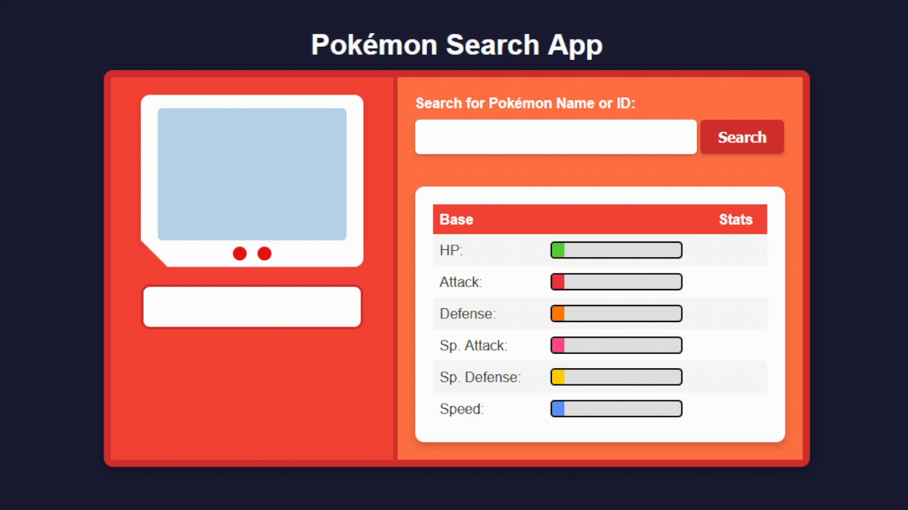

# Pokémon Search App 🕵️‍♂️🎮

A sleek and interactive web application to search and display detailed information about Pokémon using the [PokéAPI Proxy](https://pokeapi-proxy.freecodecamp.rocks/).

---

## 🌟 Features

- **Search by Name or ID**: Instantly fetch Pokémon data by entering its name or Pokédex ID.
- **Dynamic Stat Bars**: Visualize Pokémon stats as progress bars.
- **Type Badges**: Stylish and colorful badges for Pokémon types.

---

## 🚀 Demo

 

---

## 🛠️ Technologies Used

- **HTML5**: Structure and content.
- **CSS3**: Custom styles, including type badges, animations, and a Pokédex-inspired layout.
- **JavaScript (ES6)**: Core logic for fetching data, updating the UI, and handling user interactions.
- **PokéAPI Proxy**: A simplified API endpoint for fetching Pokémon data.

---

## ⚙️ Setup and Installation

1. Clone the repository:
   ```bash
   git clone https://github.com/your-username/pokemon-search-app.git
   ```
2. Navigate to the project directory:
   ```bash
   cd pokemon-search-app
   ```
3. Open `index.html` in your browser:
   ```bash
   open index.html
   ```
4. Start searching for your favorite Pokémon! 🎉

---

## 🖥️ How It Works

### Main Components:

1. **Search Functionality**:
   - Input field (`#search-input`) and button (`#search-button`) to trigger Pokémon search.
   - Fetches data from the PokéAPI Proxy and updates the UI dynamically.

2. **Pokémon Class**:
   - Encapsulates Pokémon properties like name, stats, height, weight, sprite URL, and types.

3. **Dynamic UI Updates**:
   - Displays Pokémon details (name, ID, height, weight, stats) with a responsive layout.
   - Renders type badges based on the Pokémon's type(s).

---

## 📋 File Structure

```
pokemon-search-app/
│
├── index.html         # Main HTML structure
├── styles.css         # Custom styles for the Pokédex design
├── script.js          # Core logic and API integration
└── assets/            # Static assets
```

---

## 🌈 Example Pokémon to Try

- `1` (Bulbasaur)
- `25` (Pikachu)
- `150` (Mewtwo)
- `eternatus`  
- `dragapult`  
- `greninja`
- `arceus` 

---

## 🏆 Future Enhancements

- Add Pokémon evolutions and abilities.
- Implement a comparison feature for stats between two Pokémon.

---

## 💖 Acknowledgements

- Data provided by [PokéAPI Proxy](https://pokeapi-proxy.freecodecamp.rocks/).
- Design inspired by the Pokémon universe. 🎨
